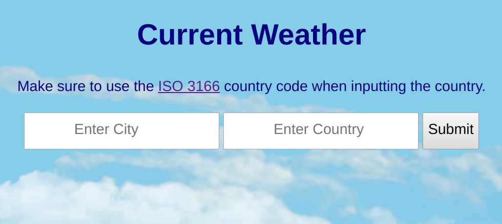

# Current Temperature (fahrenheit)

## How to Use
You will have to visit https://openweathermap.org/api to obtain an API key and then must insert that key into the "apiKey" variable on line 6 in the main.js file.

## How It's Made:

**Tech used:** HTML, CSS, jQuery, ES6

An AJAX request is made to the openweathermap API to determine the temperature in the given city.

## Optimizations:

This would have worked better with a select input because you can't use every city in any country.

## Examples:
Take a look at the rest of my portfolio.
